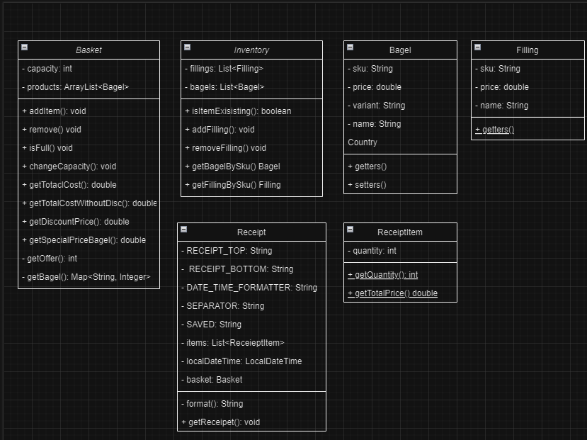

As a member of the public,
So I can order a bagel before work,
I'd like to add a specific type of bagel to my basket.

| Class  | Variables                            | Method                 | Scenario                     | Return value |
|--------|--------------------------------------|------------------------|------------------------------|--------------|
| Basket | HashMap<String, Integer> bagelBasket | addBagel(String bagel) | Empty or not valid input     | Return false |
|        |                                      |                        | Valid input add bagel to map | Return true  |

As a member of the public,
So I can change my order,
I'd like to remove a bagel from my basket.

| Class  | Variables                            | Method                    | Scenario                          | Return value |
|--------|--------------------------------------|---------------------------|-----------------------------------|--------------|
| Basket | HashMap<String, Integer> bagelBasket | removeBagel(String bagel) | Empty or not valid input          | Return false |
|        |                                      |                           | Valid input remove bagel from map | Return true  |

As a member of the public,
So that I can not overfill my small bagel basket
I'd like to know when my basket is full when I try adding an item beyond my basket capacity.

| Class  | Variables                            | Method                 | Scenario                        | Return value             |
|--------|--------------------------------------|------------------------|---------------------------------|--------------------------|
| Basket | HashMap<String, Integer> bagelBasket | addBagel(String bagel) | Empty or not valid input        | Return "no such product" |
|        | int limit                            |                        | Basket full can't add to basket | Return "basket is full   |

As a Bob's Bagels manager,
So that I can expand my business,
I’d like to change the capacity of baskets.

| Class   | Variables | Method                          | Scenario                         | Return value             |
|---------|-----------|---------------------------------|----------------------------------|--------------------------|
| Manager |           | basketCapacitySetter(int limit) | Capacity set to allowed size     | Capacity set to size     |
|         |           |                                 | Capacity set to non allowed size | Cant set the chosen size |

As a member of the public
So that I can maintain my sanity
I'd like to know if I try to remove an item that doesn't exist in my basket.

| Class  | Variables                            | Method               | Scenario                   | Return value                  |
|--------|--------------------------------------|----------------------|----------------------------|-------------------------------|
| Basket | HashMap<String, Integer> bagelBasket | remove(String bagel) | Empty input                | Invalid input                 |
|        |                                      |                      | Remove item dosen't exists | Cant remove non existing item |

As a customer,
So I know how much money I need,
I'd like to know the total cost of items in my basket.

| Class    | Variables | Method                                               | Scenario               | Return value     |
|----------|-----------|------------------------------------------------------|------------------------|------------------|
| Customer |           | costCalculator(HashMap<String, Integer> bagelBasket) | Has products           | Cost of products |
|          |           |                                                      | Basket has no products | Return 0         |

As a customer,
So I know what the damage will be,
I'd like to know the cost of a bagel before I add it to my basket.

| Class  | Variables          | Method                           | Scenario    | Return value            |
|--------|--------------------|----------------------------------|-------------|-------------------------|
| Basket | ArrayList<> bagels | getCostOfProduct(String product) | Has product | Return cost for product |
|        |                    |                                  | No product  | Return 0                |

As a customer,
So I can shake things up a bit,
I'd like to be able to choose fillings for my bagel.

| Class  | Variables                            | Method                         | Scenario               | Return value    |
|--------|--------------------------------------|--------------------------------|------------------------|-----------------|
| Basket | HashMap<String, Integer> bagelBasket | fillingToBagel(String filling) | Filling added to bagel | Filling added   |
|        |                                      |                                | Basket has no bagel    | No bagel in map |

As a customer,
So I don't over-spend,
I'd like to know the cost of each filling before I add it to my bagel order.

| Class    | Variables          | Method                  | Scenario               | Return value            |
|----------|--------------------|-------------------------|------------------------|-------------------------|
| Customer | ArrayList<> bagels | costCalculatorFilling() | Fillings price listed  | All the fillings prices |
|          |                    |                         | Basket has no products | Return no fillings      |

As the manager,
So we don't get any weird requests,
I want customers to only be able to order things that we stock in our inventory.

| Class    | Variables          | Method          | Scenario                          | Return value            |
|----------|--------------------|-----------------|-----------------------------------|-------------------------|
| Customer | ArrayList<> bagels | orderFromList() | Has chosen product in list        | Add order               |
|          |                    |                 | Don't have chosen product in list | No such product in list |

Class diagram:

